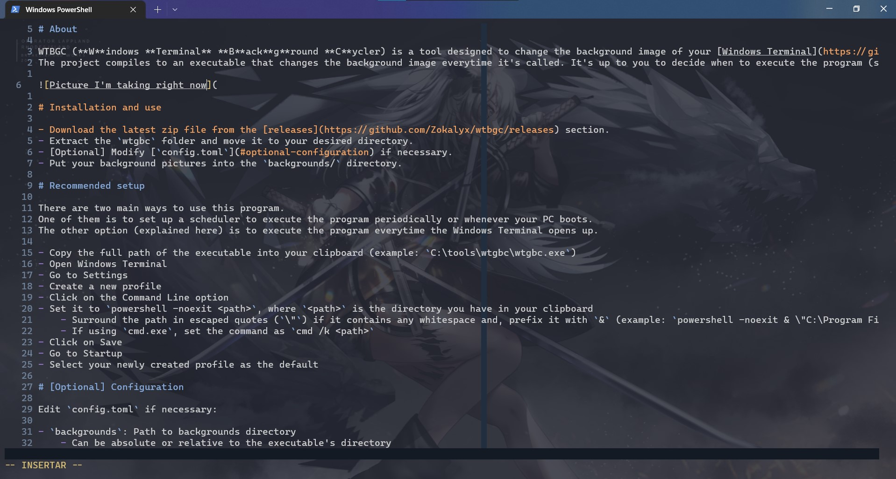

# About

WTBGC (**W**indows **Terminal** **B**ack**g**round **C**ycler) is a tool designed to change the background image of your [Windows Terminal](https://github.com/microsoft/terminal) periodically.
The project compiles to an executable that changes the background image everytime it's called. It's up to you to decide when to execute the program (see the [recommended setup](#recommended-setup) below).

# Installation and use

- Download the latest zip file from the [releases](https://github.com/Zokalyx/wtbgc/releases) section
- Extract the `wtgbc` folder and move it to your desired directory
- [Optional] Modify [`config.toml`](#optional-configuration) if necessary
- Put your background pictures into the `backgrounds/` directory

# Recommended setup

There are two main ways to use this program.
One of them is to set up a scheduler to execute the program periodically or whenever your PC boots.
The other option (explained here) is to execute the program everytime the Windows Terminal opens up.

- Copy the full path of the executable into your clipboard (example: `C:\tools\wtgbc\wtgbc.exe`)
- Open Windows Terminal
- Go to Settings
- Create a new profile
- Click on the Command Line option
- Set it to `powershell -noexit <path>`, where `<path>` is the directory you have in your clipboard
    - Surround the path in escaped quotes (`\"`) if it contains any whitespace and prefix it with `&` (example: `powershell -noexit & \"C:\Program Files\wtgbc\wtgbc.exe\"`)
    - If using `cmd.exe`, set the command as `cmd /k <path>`
- Click on Save
- Go to Startup
- Select your newly created profile as the default

# [Optional] Configuration

Edit `config.toml` if necessary:

- `backgrounds`: Path to backgrounds directory
    - Can be absolute or relative to the executable's directory
    - Default: `backgrounds/` (relative)
- `backups`: Path to the Windows Terminal `config.json` backups directory
    - Can be absolute or relative to the executable's directory
    - Default: `backups/` (relative)
- `wt_profile`: Path to the Windows Terminal `config.json`
    - Relative to `$HOME`
    - Default: `AppData/Local/Packages/Microsoft.WindowsTerminal_8wekyb3d8bbwe/LocalState/settings.json
- `extensions`: Valid image file extensions
    - Default: `[gif, png, jpg, jpeg]`
- `mode`: Determines the cycling mode (`random` or `cycle`)
    - WARNING: Currently has no effect
    - Default: `random`

# [Optional] PATH setup

If you want to be able to change the background image on the fly while inside the Windows Terminal,
it's recommended that you add the executable to your PATH environment variable.
This will allow you to type `wtgbc` in the terminal to update the image.

- Copy the directory of the executable (example: `C:\tools\wtgbc\`)
- Press the Windows key
- Search for "Environment"
- Select Modify environment variables
- Click on Environment Variables
- Find the PATH entry and click on it
- Click Edit
- Click New
- Paste the directory
- Click OK until you have closed every window
- Restart your Windows Terminal

# Issues

- Allow CLI argument to specify an image
- Change executable name to something more comfortable
- Add absolute path support for backgrounds and backups
- Add optional support for backups
- Improve error handling
- Divide code into functions
- Implement cycle mode
- Prevent images from appearing twice in a row
- Set timestamps on backup files
- Create tutorial video/gif for setup
- Create actual issues :p
- Improve readability of code
- Create an option to limit the amount of times the image can change in some time span

